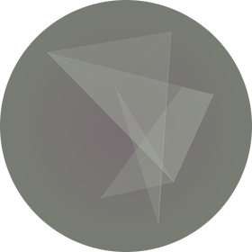

<div align="center">
  
</div>

# Origamicons

(Almost) unique identicons - Based on SHA-1 and inspired by folded paper.

## How to Use

### Requirements

This program is written in **Python 3.6**.  
Requirements are listed in _requirements.txt_ and can be installed with Pip:

```bash
cd origamicon
pip install -r requirements.txt
```

### Web App

The web app can be started by executing `app.py` inside the _origamicon_ folder:

```python
python app.py
```

#### URL Parameter

Origamicons can be requested directly using URL parameters, e.g. `localhost:5000/mailea`

### Command Line Tool

The avatar generator can also be used as a command line tool:

```python
python generator.py
```

## Online

To see the web app in action, click [here](https://origamicons.herokuapp.com).
